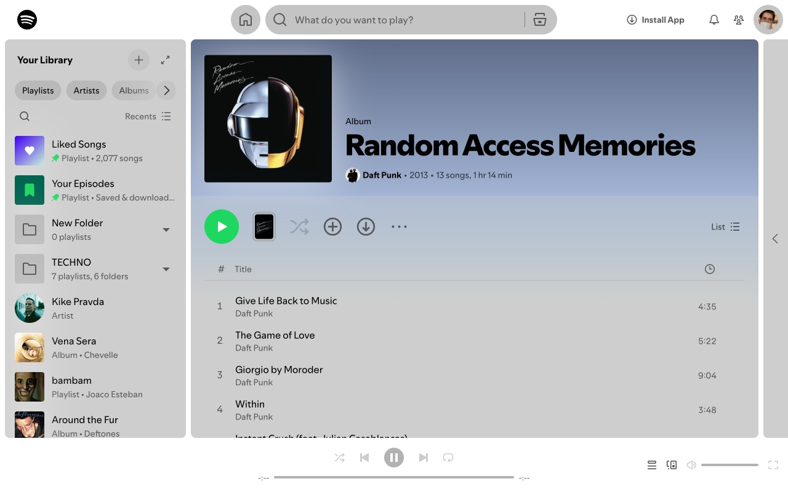

# Spotify Light Mode

A browser extension that brings light mode to Spotify's web player — always on, or only when your OS is in light mode.

Spotify has never shipped a light mode for its web player. This extension intercepts the color tokens Spotify injects at runtime and replaces them with a curated light palette, before the page finishes painting so there's no dark flash on load.



## Features

- Light theme for the complete Spotify web player
- Instant toggle — no page reload, no delay
- System preference sync — follows your OS light/dark setting automatically
- Runs at document start — zero dark flash on load
- Watches for dynamic style updates as you navigate
- No external requests, no analytics, no tracking

## Popup controls

**Enable extension** — turns light mode on or off globally. Takes effect immediately.

**Use system preference** — when enabled, light mode only activates when your OS is set to a light color scheme. Switch your system to dark mode and Spotify reverts to its default automatically.

## Development

Requires [Bun](https://bun.sh).

```sh
bun install

bun run dev          # Chrome with HMR
bun run dev:firefox  # Firefox variant
bun run build        # Production build → .output/chrome-mv3/
bun run zip          # Zip for distribution
```

Load unpacked in Chrome: `chrome://extensions` → "Load unpacked" → select `.output/chrome-mv3-dev/`

## Tech stack

| | |
|---|---|
| [WXT](https://wxt.dev) | Extension framework — manifest generation, entrypoint discovery, HMR |
| [Bun](https://bun.sh) | Package manager and dev runner |
| React | Popup UI |
| TypeScript | Strict mode |
| [Zod](https://zod.dev) | Runtime validation on storage reads |
| [chroma-js](https://gka.github.io/chroma.js/) | Color manipulation for dynamic palette overrides |

## Permissions

**Storage** — the only permission requested. Used exclusively to remember your on/off and system preference settings between sessions. The extension has no access to your Spotify account, listening history, or credentials.

## Compatibility

Works on `open.spotify.com` in Chrome and Chromium-based browsers. Does not affect the Spotify desktop app or mobile apps.
